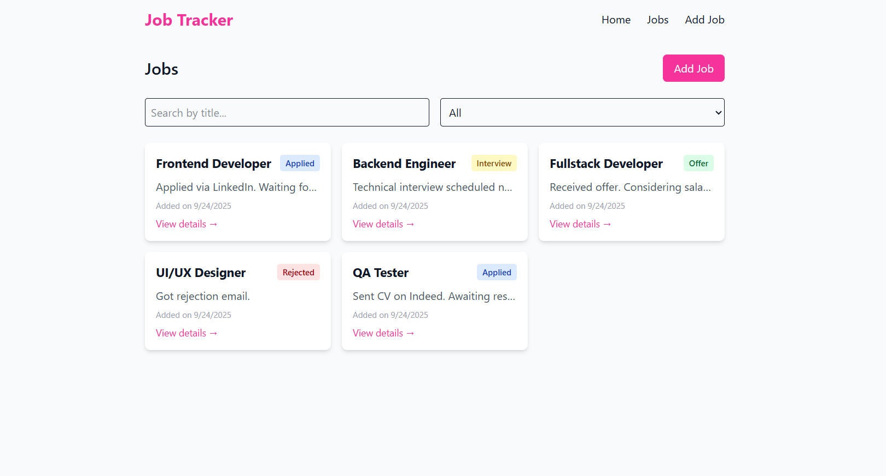
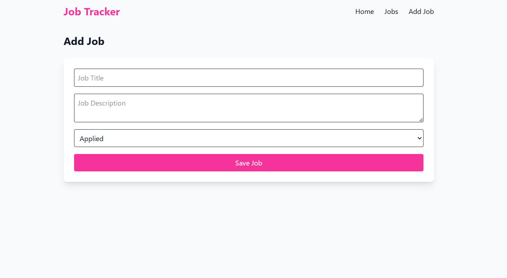
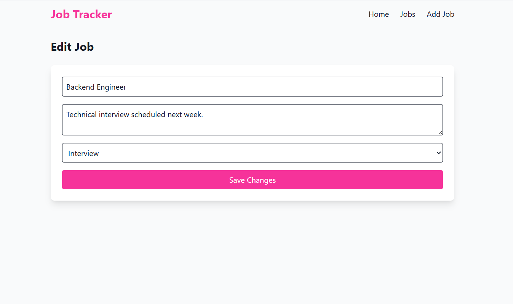
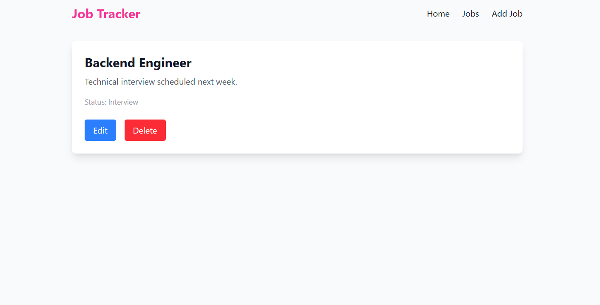

# Job Tracker

**Job Tracker** is a React SPA built with Tailwind CSS that allows users to manage job applications: add, edit, filter, and delete jobs.

--

## 📌 Features

- Add new jobs with title, description, and status
- Edit existing jobs
- Delete jobs with confirmation and toast notifications
- Filter jobs by title and status
- Save jobs in Local Storage (includes demo jobs on first load)
- Responsive modern UI with Tailwind CSS

--

## 🛠 Technologies

- React 19.1.1
- React Router
- Tailwind CSS
- Local Storage for job data
- React Toastify (for notifications)

--

## 🚀 Run Locally

1. Clone the repository:

```bash
git clone https://github.com/stepaEliz/job-tracker.git
cd job-tracker
```

2. Install dependencies:

```bash
npm install
```

3. Run the development server:

```bash
npm run dev
```
Open http://localhost:5173 in your browser.

--

## 🌐 Live Demo

[View live demo on Vercel]()

--

## 🖼 Screenshots






--

## 📝 Notes

First-time users will see demo jobs already loaded in the app.

Toast notifications appear when a job is added, edited, or deleted.

Filter and search functionality are available on the Jobs page.

--

## 📄 License
[MIT](https://choosealicense.com/licenses/mit/) © Elizaveta Stepanishina

